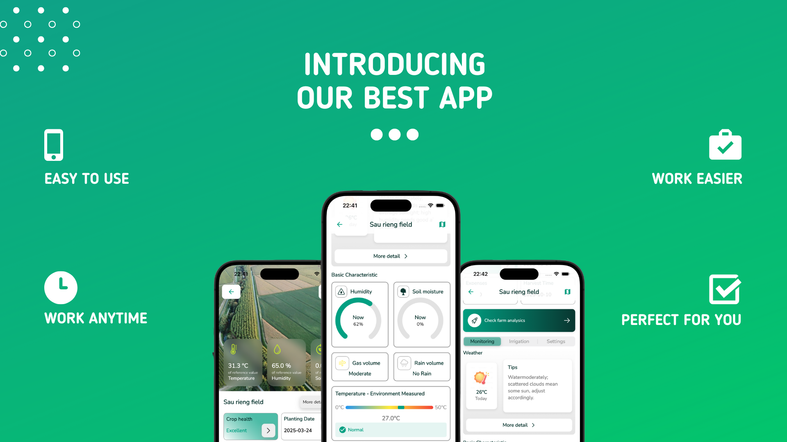

# Green Farm

Green Farm is a smart cultivation, farm management, and irrigation application designed to enhance modern farming through technology. It helps farmers monitor and optimize their farm operations using real-time data, AI-driven insights, and automation.

## 🚀 Features

- **View Farm from Satellite**: Get an aerial view of your farm using satellite imagery.
- **Real-time Environmental Monitoring**: Track temperature, humidity, and soil conditions via MQTT-based sensors.
- **Weather API Integration**: Access up-to-date weather forecasts to plan farm activities.
- **Farm & Water Usage Analysis**: Gain insights into water consumption and farm productivity.
- **Gemini AI Assistant**: Get AI-driven farming recommendations and automation.
- **Custom Machine Learning Model**: Predict water needs and plant health for optimal growth.

## 🛠️ Tech Stack

### Frontend:

- **Flutter** – Cross-platform mobile application development.

### Backend:

- **NestJS** – Scalable and efficient backend framework.
- **Firebase Authentication** – Secure user authentication and authorization.
- **MongoDB** – NoSQL database for storing farm-related data.

## 📷 Overview Image



## 📷 Giao diện ứng dụng

| Landing                                           | Login                                                | Sign Up                                                |
| ------------------------------------------------- | ---------------------------------------------------- | ------------------------------------------------------ |
|       |           |         |
| Homepage                                          | Homepage                                             | Set up field success                                   |
|      |      |        |
| Set up step 1                                     | Set up step 2                                        | Set up step 3                                          |
|      |        |        |
| Field Detail Page                                 | Weather Widget                                       | Realtime Sensor Monitoring                             |
|  |  |  |
| Water History                                     | Water Statistic                                      | Watering Monitoring                                    |
|     |      |     |
| Weather                                           | Weather At Night                                     | Notification                                           |
|       |   |    |
| All Elements Weekly Chart                         | All Elements Daily Chart                             | AI Chatbox                                             |
|  |     |          |
| Single Elements Weekly Chart                      | Single Elements Daily Chart                          | Field From Sattelite                                   |
|  |     |            |
| Profile                                           | Edit Profile                                         | Edit Notification                                      |
|       |    |   |
| Field List                                        | News                                                 | Login with Google                                      |
|    |            |   |

## 🎥 Demo Video

[](https://youtu.be/RrVnXG1siQs?si=Z5d6ZeedE-aG0pOw)

## 🔧 Setup & Installation

### Prerequisites

- Install **Flutter** ([Flutter Installation](https://flutter.dev/docs/get-started/install))
- Install **Node.js** and **NestJS**
- Setup **Firebase**
- Install **MongoDB**

### Installation Steps

1. **Clone the Repository**

   ```bash
   git clone https://github.com/your-repo/green-farm.git
   cd green-farm
   ```

2. **Setup Frontend**

   ```bash
   cd frontend
   flutter pub get
   flutter run
   ```

3. **Setup Backend**

   ```bash
   cd backend
   npm install
   npm run start
   ```

4. **Configure Firebase**

   - Add your Firebase credentials in the project.

5. **Run the App**
   - Start the Flutter app and backend service.

## 🤝 Contributing

Contributions are welcome! Feel free to fork this repository, submit issues, and create pull requests.

## 📄 License

This project is licensed under the MIT License.

---

Made with ❤️ by Nguyen Dat Khuong
